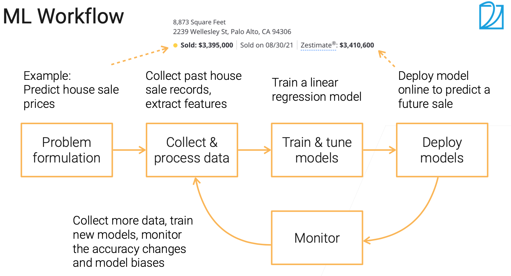
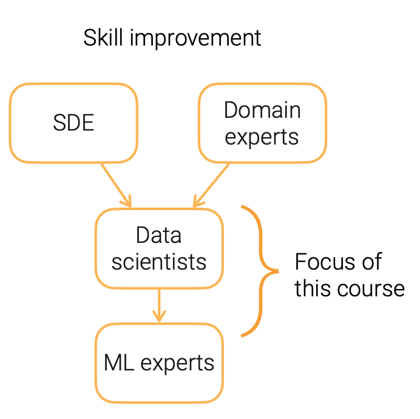

# 课程介绍 Course Introduction

## 工业界机器学习案例

- 加工制造业：养护预测，质量控制
- 零售业：推荐系统，对话机器人，需求预测
- 健康行业：病人数据实时预警，疾病识别
- 金融业：诈骗识别，应用处理
- 汽车业：失败预测，自动驾驶

## 机器学习工作流程

## 机器学习的挑战

- 问题构成：关注影响最大的工业界难题
- 数据：高质量数据稀缺，数据隐私问题
- 模型训练：模型复杂度增加，数据缺乏，花费大
- 模型部署：高算力需求vs实时推理
- 监督：数据分布漂移，公平问题

## 课程内容

- 数据
  - 数据收集/预处理
  - 协方差/概念/标签漂移
  - 非IID数据
- 训练
  - 模型评估/组合/调优
  - 迁移学习
  - 多模态
- 部署
  - 模型部署
  - 蒸馏
- 监督
  - 公平性
  - 可解释性

## 职业规划

- 领域专家：熟知应用领域，如零售行业、自动驾驶
- 软件开发工程师：开发维护数据工具链、训练模型
- **数据科学家(该课程目的)**：数据处理及模型部署
- 机器学习专家：精通SOTA模型

> Reference Reading：[Challenges in Deploying Machine Learning](https://arxiv.org/pdf/2011.09926.pdf)