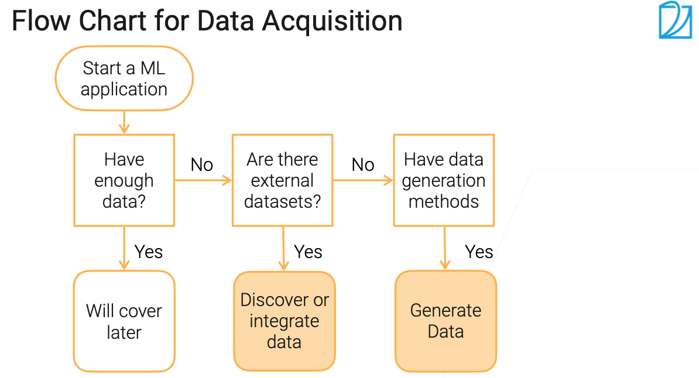
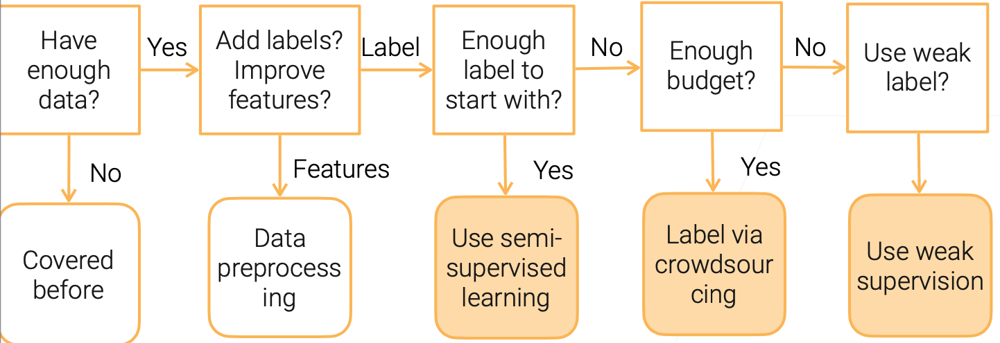
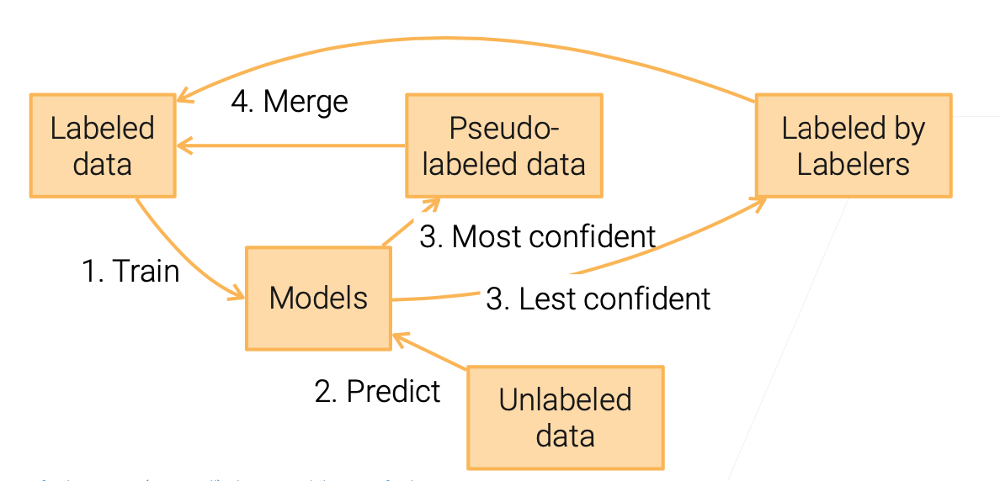

# 1 Data Collection 数据收集

## Data acquisition 数据获取

### 流程图

### 发现数据

- 识别已存在数据库
- 找到基准数据库去评估新想法
  - 调超参的算法：一个多样的中小型数据库
  - 训练超大型深度神经网络：大规模数据库

#### 主流数据库
!*英文数据库*

- MNIST: 手写英文数字（）
- ImageNet: 百万张标注图片
- AudioSet: 语音分类录音
- LibriSpeech: 1000小时英文语音
- Kinetics: 动作分类视频
- KITTI: 自动驾驶
- Amazon Review: 客户评论
- SQuAD: 来自Wikipedia的问答

> [!TIP]
> 国内开源数据库下载平台[格物钛 Graviti](https://gas.graviti.cn/open-datasets)

> [!NOTE]
> MNIST已经用烂了~，现在CV入门Fashion-MNIST更适合

*https://en.wikipedia.org/wiki/List_of_datasets_for_machine-learning_research*

#### 搜索数据库

- [Paperswithcodes Datasets](https://paperswithcode.com/datasets): 带排行榜的学术数据库
- [Kaggle Datasets](https://www.kaggle.com/datasets): 数据科学家上传分享的私有数据
- [Google Dataset search](https://datasetsearch.research.google.com/): 数据库搜索引擎
- 工具包带的数据库: [tensorflow](https://www.tensorflow.org/datasets), [huggingface]((https://huggingface.co/docs/datasets/)
- 会议/公司ML竞赛
- [Open Data on AWS](https://registry.opendata.aws/): 100+ 大规模原始数据
- 内部组织组织数据（很可能是原始数据）

#### 不同种类数据比较

||Pros|Cons|
|-|---|---|
|学术数据库|已清洗，难度适中|选择有限，太简单，通常规模都很小|
|竞赛数据库|接近真实环境下机器学习的应用|简单，只有热门领域才有|
|原始数据|特别灵活|需要大量精力处理|

- 工业场景需要处理原始数据
- 需要多团队参与，处理管道、存储、法律团队、安全团队

#### 数据整合

- 合并多来源数据到一个一致的数据库
- 通过关键字合并表（通常是ID）
- 问题：识别IDs，缺失行，冗余列，值冲突

### 合成数据

- GAN
- Data augmentations（数据增强）

> [!NOTE]
> - 近年来研究，对于自动驾驶等复杂环境数据，仿真环境下采集也是一种方法。
> - few-shot learning近年来的发展也不错。

> Reference Reading：[Data Collection for Machine Learning](https://arxiv.org/pdf/1811.03402.pdf)

## Web scraping 网页抓取（爬虫）
> 页面抓取示例见这篇Blog[Todo]

- 从网站提取数据
  - 有噪音，弱标注，可能是垃圾数据
  - 规模可观
- 爬虫(Crawling)VS网页抓取(Scrapping)
  - 爬虫：爬取互联网整上所有页面信息
  - 网页抓取：只抓取特定的页面信息

> [!ATTENTION]
> - 商业目的爬虫，注意法律风险
> - 学术目的从网络获取的数据，要注意能否在论文中应用

### 成本

- 以AWS EC2 t3.small (2GB memory, 2 vCPUs, \$0.02/小时)为例
  - 2GB是浏览器所需最小内存,CPU和带宽通常不是问题
  - 可以使用Spot实例来降低成本
- 抓取1M栋房子的文本信息需要$16.6
  - 平均3s一个网页
  - 使用100个实例需要8.3小时
  - 其他花费包括存储（更贵！），更换IP重启实例的费用
- 一栋房子大概20张图片
  - 抓取1M栋房子图片大概需要$300
  - 存储费用大约 \$300/月

### 法律问题

- 页面抓取本身不违法
- 小心下面的操作
  - 不要抓取敏感信息，例如包括用户名/密码，个人健康医疗等个人信息等
  - 不要抓取版权内容，例如YouTube视频，Flicker图片等
  - 服务协议中是否直接声明禁止抓取
- 以盈利为目的抓取先咨询律师

## 数据标注 Data labeling 

### 流程图

### 半监督学习 Semi-Supervised Learning (SSL)

- 适合场景：少量标注数据+大量未标注数据
- 未标注数据的分布需要满足下列假设：
  - 连续性假设 Continuity assumption: 相似特征的样本有相似的标签
  - 聚类假设 Cluster assumption: 数据有内在的聚类结构，同一聚类的样本倾向有相同的标签
  - 流形假设 Manifold assumption: 数据位于比输入空间维度低得多的流形上，数据内在复杂性低，有降维空间
- 自训练方法(Self-trainning)
  - 现有标签训练模型，模型预测未标注数据，只保留高置信度的标签，循环
  - 可以使用复杂模型，如DNN，model ensemble/bagging
  - 常与主动学习联合应用

### 众包 Crowdsourcing

- Amazon SageMaker Ground Truth估算的Amazon Mechanical Turk(众包平台)价格:
| 标注类型 | 单价 | 
|-- | --|
|图像/文字分类|\$0.012/标签|
|画框(Bounding box)|\$0.024/框|
|语义分割|\$0.84/图|

#### 挑战
- 简化标注员交互界面：设计简单任务，清晰的指令和简单的用户操作
  - 复杂任务需合格标注员（医学影像标注）
  - 成本=任务数量x单任务时间x标注员时间单价
  - 例子 MIT Place365 标注界面
- 质量控制:取决于不同的标注员
  - 多标注，投票机制确认标签
  - 通过复杂样本筛选低质量标注员

#### 主动学习(Active Learning)

- SSL使用场景相似，但有人工介入，减少任务数量
  - 人工只标注最感兴趣的未标注数据
- 感兴趣数据的选择：
  - 不确信采样 Uncertainty sampling: 最高分类分数接近于随机选择
  - Query-by-committee: 多模型投票选出较难的数据
- 常与自训练联合应用

### 弱监督 Weak Supervision

- 半自动产生标签
  - 比人工标注准确率低，但训练任务够用
- 数据编程 Data programming: 启发式编程分派标签
  - 关键字搜索，模式匹配，第三方模型
