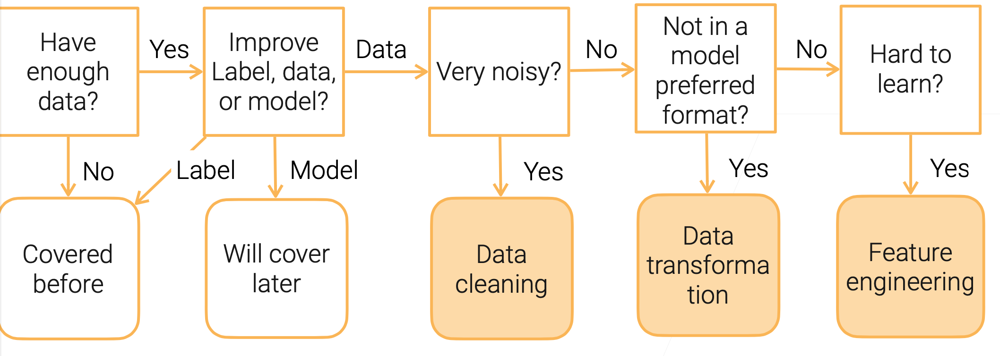

# 2 数据预处理 Data Preprocessing 

## 流程图

## 探索性数据分析 Exploratory data analysis	

[示例代码](slides/cs329p_notebook_2_1_eda.slides.html ':include')

**常用库**

- `Jupyter Notebook`: 交互式IDE, 支持Python，Julia，R
- `numpy`: np 线性运算
- `pandas`: pd 数据表处理
- `matplotlib.pyplot`: plt 画图表的
- `seaborn`: sns 画图的
- `IPython`: 优化显示

## 数据清洗 Data cleaning

### 数据错误

- 数据错误: 数据与真实存在误差（主要是标签）
- 优秀的ML模型对数据错误有抗性
  - 训练中如果包含错误数据，准确率可能降低
  - 在线应用这些模型会影响后续新收集数据的质量
- **错误类型**
  - 异常值(outliers): 一列（特征）中严重偏离分布的值
  - 违反规则(rule violations): 违反数值规则，如"Not Null",  "Must be unique", "Non negative"
  - 违反模式(patter violations): 违反句法或语义规则，如对齐、格式、拼写错误

### 错误检测

- **异常值检测 Outlier Detection:** 通过统计方法，boxplot超过1.5 box length
- **基于规则检测 Rule-based Detection**
  - 功能依赖(Functional dependencies): 源自数据库中映射，x → y 意味着一个x值确定一个唯一的y值
    - 例：邮政代码 → 州, 美国 EIN → 公司名称
  - 拒绝约束(Denial constraints): 更灵活的一阶逻辑表达式
    - 例：有EIN的供应商号码一定不为空，如果同一动物的两张照片拥有一样的标签，则第一个一定被认为是原始图片

- **基于模式检测 Pattern-based Detection**
  - 句法模式(Syntactic patterns)
    - 例：eng -> English，设定一列数据中主要的数据类型为该列数据类型，识别出其中不符合该类型的值
  - 语义模式(Semantic patterns)
    - 例：通过知识图谱添加规则，如国家一定有首都，Standford没有首都，所以不是国家类型

- 很多工具可以帮助数据清洗
  - 通过图形化界面进行交互式清洗
  - 自动检测并识别错误

## 数据转换 Data transformation	

- 将数据转换为ML算法要求的格式
- 平衡**存储**，**质量**和**加载速度**

- 不同数据类型的转换：

### 数值(表格)正则化

| 方法 | 公式 |
|--|--|
| 极值归一化:线性映射到新区间 $\left [ a, b \right ]$ | $x_{i}^{\prime}=\frac{x_{i}-\min _{\mathbf{x}}}{\max _{\mathbf{x}}-\min _{\mathbf{x}}}(b-a)+a$|
| Z-score标准化: 期望0, 方差1 | $x_{i}^{\prime}=\frac{x_{i}-\operatorname{mean}(\mathbf{x})}{\operatorname{std}(\mathbf{x})}$ |
| 十进制缩放 | $x_{i}^{\prime}=\frac{x_{i}}{10^{j}} \quad\text{smallest }j\text{ s.t. }\max(\left\vert\mathbf{x}^{\prime}\right\vert)<1$ |
| Log缩放 | $x_{i}^{\prime}=\log \left(x_{i}\right)$ |

### 图片转换

- 图片数据存储空间占用大
- 下采样 downsampling & 剪切 cropping
  - 降低图像尺寸来节约存储空间，加快读取速度
  - ML能够很好的处理低分辨率图像
  - 注意格式(jpedg)对图片质量的影响：中等(80%-90%)jpeg压缩 → 准确率降低1%
- 图像白化(Image Whitening)
  - 降维剔除图片冗余信息
    - 图像向量标准化
    - 相邻像素高度相关
    - 白化移除线性变换后的冗余信息
    - 向量x均值为0协方差为Σ
    - $y=Wx, \text { st } W^{T} W=\Sigma^{-1}$ y 具有单位对角协方差
    - 白化矩阵的常见选择: $\sum(PCA), \sum^{-\frac{1}{2}}(ZCA)$特征系统，
  - 加快训练速，尤其是无监督学习，如GAN

### 视频转换

- 数据差异大
  - 视频平均长度: 电影 ~2h，Youtube ~11min，抖音 ~15sec
- 通过预处理来平衡存储、质量和加载速度
- 通常使用的是视频片段(<10s)
  - 一个片段通常包含一个独立事件(如人的动作)
- 解码视频成一系列帧
  - 读取容易，但是消耗10x的存储空间
  - 成本上，算力也许比存储更便宜(GPU解码)
  - 可以对解码后的帧应用图像变换技术

### 文字转换

- 词干提取和词形还原(Stemming&Lemmatization)
  - e.g. am,are,is→be car,cars,car's,cars'→car
- 分词(Tokenization): 文本→一串tokens(ML中最小的处理单元)
  - 单词: `text.split(' ')`
  - 字母: `text.split('')`
  - 字词(subwords):
    - e.g. "a new gpu!"→"a","new","gp","##u","!"
    - Unigram, WordPiece,..
    - 习得的词表

## 特征工程 Feature engineering		

## 总结 Data summary