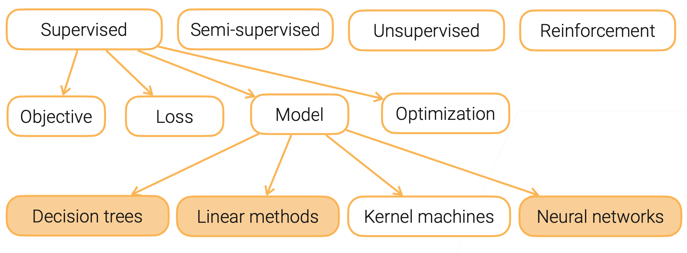

# 3 机器学习模型 ML model recap

## 机器学习模型概览 ML Model Overview

### ML算法类型

- 监督（Supervised）
  - 未标注数据
    - 自监督学习（Self-supervised learning）：由数据生成标签 eg. word2vc, BERT, MAE
    -  GAN
- 半监督（Semi-supervised）
- 非监督（Unsupervised）
- 强化学习（Reinforcement Learning）

### 监督学习组件

- 模型（Model）：参数方程，**输入**和**标签**间建立映射。
  - 参数模型 VS 超参数
- 损失函数（Loss）：评价模型预测结果的好坏。
  - eg. classification（分类）/regression（回归）/contrastive（对比）/triplet（三元组）/ranking（排序）
- 目标（Objective）：用来优化模型参数，eg.损失函数和最小化
- 优化（Optimization）：使模型达成目标的算法。
  
### 监督模型种类

- 决策树（Decision trees）
- 线性方法（Linear methods）
- 核机器（Kernel machines）：SVM
- 神经网络（Neural network）

## 决策树 Decision Trees

## 线性模型 Linear Methods

## 多层感知机 MLP

## 神经网络 Neural Networks